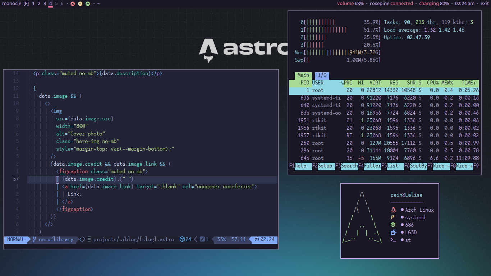

# mnml-bspwm

Minimal bspwm envionment



## Installation

1. Install [fish shell](https://fishshell.com) first
2. Clone this repo
3. And run `cd mnml-bspwm && ./install.fish`


## Notes

- This setup **does not** use a display manager
- After logging in to tty, run `startx` to start bspwm
- File manager, browser, archiver etc. will not be installed
- If by any chance scripts are not executable, run `chmod +x SCRIPTFILE`


## Programs

```plaintext
bspwm, polybar, sxhkd, dunst, dmenu, st, slock, feh, brightnessctl, pamixer, xdg-desktop-portal, xdg-desktop-portal-gtk, polkit-gnome, gnome-keyring
```


## Additional configurations

Here are some more tricks

### Touchpad improvements

Create a drop-in file in `/etc/X11/xorg.conf.d/30-touchpad.conf`

```conf
Section "InputClass"
    Identifier "touchpad"
    Driver "libinput"
    MatchIsTouchpad "on"
    Option "Tapping" "on"
    Option "NaturalScrolling" "true"
EndSection
```

### Gnome-keyring PAM setup

Edit and add the following in `/etc/pam.d/login`

```plaintext
auth       optional     pam_gnome_keyring.so
session    optional     pam_gnome_keyring.so auto_start
```

### Use gnome-keyring with git

```bash
git config --global credential.helper /usr/lib/git-core/git-credential-libsecret
```


# Enjoy
